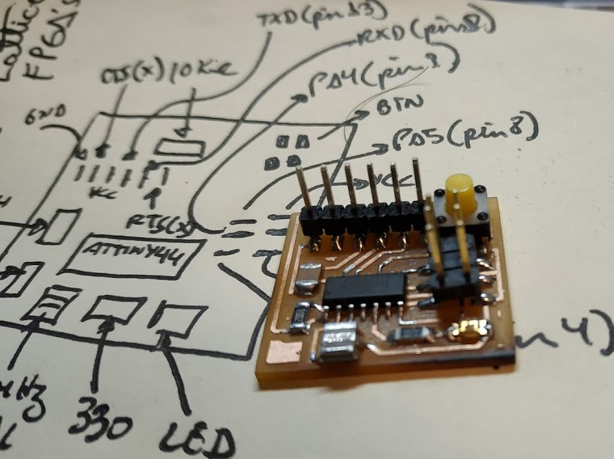
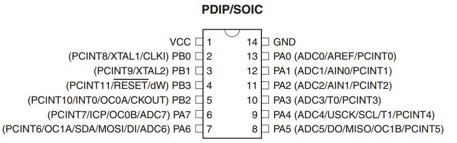

# ATTiny44
Small repository of my ATTiny44 projects using Arduino IDE

 
 

Changelog: 

15-10-2018: Used an Arduino Mega 2560 clone as an AVR ISP programmer, no luck. Instead used an Arduino UNO clone and it worked, no need for a 10uF between RST and GND pins on the Arduino UNO.

You have to put the following URL (https://raw.githubusercontent.com/damellis/attiny/ide-1.6.x-boards-manager/package_damellis_attiny_index.json) on the boards manager on "Files/Preferences". Then enable it on the "Tools/Board/Boards Manager" menu on the Arduino IDE. Later you have to program your Arduino UNO as an AVR ISP programmer. Then select Arduino as ISP on the "Tools/Programmer" menu on the Arduino IDE. Just follow the steps stated on the following URL:

http://archive.fabacademy.org/2017/fablabkamplintfort/students/390/week06.html

14-10-2018: Prototype made using SMT devices, ATTiny44 running on 20MHz crystal resonator, pin 5 connected to a LED through a 330ohm resistor, pin10 connected to a button (high-active). Following is how Arduino label those pins in its IDE: 
 
